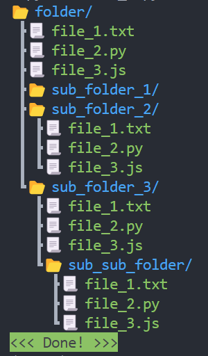

# Python Task Solutions

This repository contains solutions for four tasks implemented in Python. The tasks involve calculating total and average salaries, reading and processing cat information, displaying a directory structure, and managing a phonebook via a command-line interface.

## Task 1: Calculate Total and Average Salary

[**File:** `task_1.py`](./task_1.py)

### Description

This task calculates the total and average salary of employees from a given file.

### Usage

1. Place the employee salary data in a file (e.g., `salary.txt`) with each line containing the employee name and salary separated by a comma.
2. Run the script `task_1.py`:

```bash
python task_1.py
```

3. The script will output the total and average salary of employees.

### Example

Content of `salary.txt`:

```txt
Alex Korp,3000
Nikita Borisenko,2000
Sitarama Raju,1000
```

Output:

```bash
Total salary: 6000, Average salary: 2000.0
```

## Task 2: Read Cats Information from a File

[**File:** `task_2.py`](./task_2.py)

### Description

This task reads a file containing cat information and returns a list of dictionaries containing the information for each cat.

### Usage

1. Place the cat information in a file (e.g., `cats.txt`) with each line containing the cat ID, name, and age separated by commas.
2. Run the script `task_2.py`:

```bash
python task_2.py
```

3. The script will output the list of dictionaries with cat information.

### Example

Content of `cats.txt`:

```txt
60b90c1c13067a15887e1ae1,Tayson,3
60b90c2413067a15887e1ae2,Vika,1
60b90c2e13067a15887e1ae3,Barsik,2
60b90c3b13067a15887e1ae4,Simon,12
60b90c4613067a15887e1ae5,Tessi,5
```

Output:

```bash
[{'id': '60b90c1c13067a15887e1ae1', 'name': 'Tayson', 'age': 3}, {'id': '60b90c2413067a15887e1ae2', 'name': 'Vika', 'age': 1}, {'id': '60b90c2e13067a15887e1ae3', 'name': 'Barsik', 'age': 2}, {'id': '60b90c3b13067a15887e1ae4', 'name': 'Simon', 'age': 12}, {'id': '60b90c4613067a15887e1ae5', 'name': 'Tessi', 'age': 5}]
```

## Task 3: Directory Structure

[**File:** `task_3.py`](./task_3.py)

### Description

This task prints the structure of a directory in a tree format.

### Usage

1. Run the script `task_3.py` with the path to the directory you want to print:

```bash
python task_3.py <directory_path>
```

2. The script will output the directory structure.

### Example

```bash
python task_3.py ./folder
```

Output:

<p align="center">
    
p>

## Task 4: Phonebook

[**File:** `task_4.py`](./task_4.py)

### Description

This task provides a command-line interface to manage a phonebook. Users can add, change, retrieve, and list contacts.

### Usage

1. Run the script `task_4.py`:

```bash
python task_4.py
```

2. Enter commands to interact with the phonebook.

### Commands

- `hello`: The bot will greet you and ask how it can help you.
- `add <name> <phone>`: Adds a contact with the given name and phone number. Example: `add John 123456789`.
- `change <name> <new_phone>`: Changes the phone number of the contact with the given name. Example: `change John 987654321`.
- `phone <name>`: Retrieves the phone number of the contact with the given name. Example: `phone John`.
- `all`: Lists all contacts with their phone numbers.
- `exit` or `close`: Exits the assistant bot.

### Example

```bash
Welcome to the assistant bot!
Enter a command: add John 123456789
Contact added.
Enter a command: phone John
123456789
Enter a command: all
John: 123456789
Enter a command: exit
Good bye!
```

## License

This project is licensed under the [MIT License](./LICENSE).
